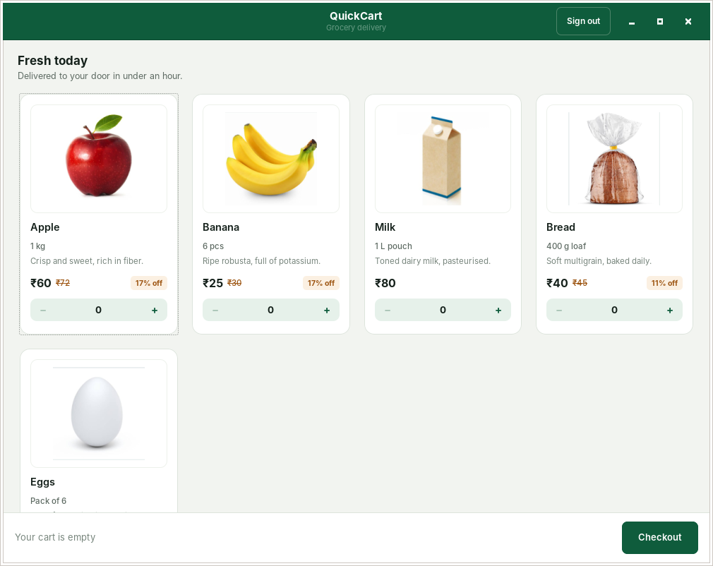
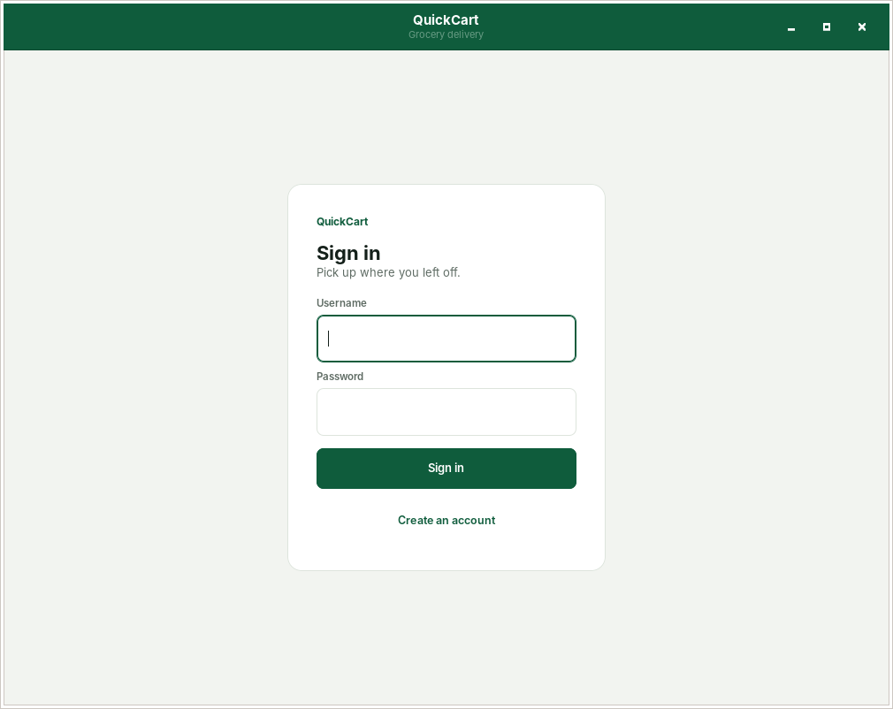
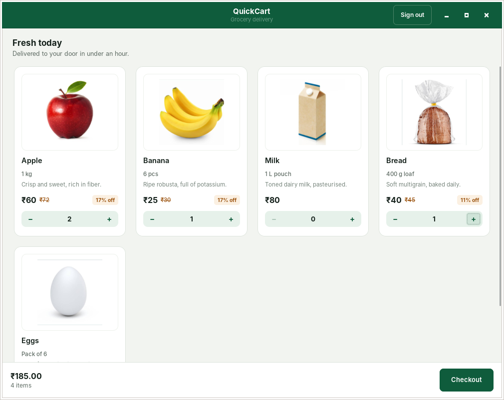
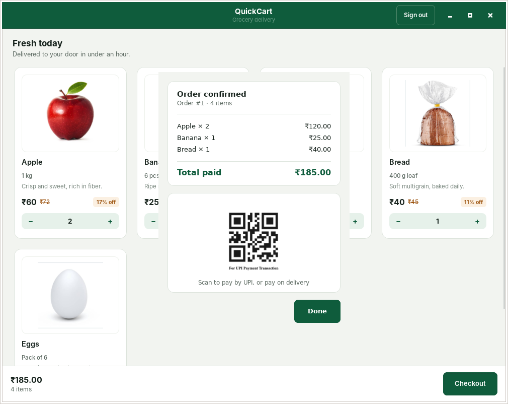

# 🛒 QuickCart — GTK-Based Shopping Cart Application (C, GTK3, SQLite)

A **desktop grocery shopping application** written in **C**, using **GTK 3** for
the interface and **SQLite** for persistence — user authentication, a live
product catalog, a quantity-based cart, and checkout with an itemized receipt.

This started as a course mini-project and has since been rebuilt: the
security issues were fixed, the codebase was split into modules, and the
interface was redesigned around a real visual system rather than default
GTK styling.

<p align="center">
  
</p>

---

## Screenshots

| Sign in | Cart | Checkout |
|---|---|---|
|  |  |  |

---

## Why this project matters

This project demonstrates:

- Building **GUI desktop software in C** with GTK 3
- Integrating **SQLite** safely — parameterized queries, transactions, schema design
- **Salted password hashing** implemented from scratch (SHA-256, verified against NIST test vectors)
- Structuring an application into modules (`db`, `ui`, `model`, cross-platform path resolution) instead of one file
- Designing a **coherent visual system** — a defined color palette, type scale, and component states — rather than default widget styling
- Shipping with a **build system** (`Makefile`) and a `dist` target, instead of an unrepeatable manual compile step

---

## Key features

**Authentication** — sign in / sign up, salted password hashing, inline validation errors (empty fields, password mismatch, duplicate username)

**Product catalog** — a `GtkFlowBox` grid with product photos, unit sizes, list-price strikethroughs, and discount tags

**Cart** — per-item quantity steppers (capped, so nothing grows unbounded), a live running total in the footer bar

**Checkout** — an itemized receipt dialog with the order total and a UPI QR code, written to the database in a single transaction

**Order history (data layer)** — every completed order and its line items are persisted to `Orders` / `OrderItems` tables

---

## What changed from the original version

The original single-file version (still visible in this repo's history) worked, but
had real problems. Each one was found by review and then **verified fixed** by
running the app headlessly and inspecting the resulting database:

| Issue | Before | After |
|---|---|---|
| **SQL injection** | Login query built with `sprintf` + raw input — `' OR '1'='1` logged in as anyone | Parameterized queries (`sqlite3_bind_text`) throughout; the same payload now correctly fails |
| **Password storage** | Stored in plain text | Per-user random salt + `SHA-256(salt + password)` |
| **Checkout state** | Cart quantities were never cleared after checkout, so the next order silently included the previous one | Cart resets after a successful, transactional order write |
| **Order history** | Never saved anywhere — checkout just showed a dialog | `Orders` / `OrderItems` tables, written atomically |
| **Portability** | Image paths hardcoded to `C:/Users/<name>/Desktop/...` | All resource paths resolve relative to the executable, verified on Linux from an arbitrary working directory |
| **Buffer safety** | Bill text built with `strcat` into a fixed `char[1024]` | Dynamic `GString`; remaining fixed buffers use bounded `snprintf` |
| **Quantity limits** | No upper bound on the stepper | Capped at 20 per item |
| **Silent failures** | Bad login / duplicate signup did nothing visible | Specific inline error messages |
| **Window management** | Three top-level windows, hidden (not destroyed) on navigation | One window, one `GtkStack` |
| **Styling** | `style.css` defined classes that were never attached to any widget, so nothing rendered | Classes applied throughout; a full palette, type scale, and component states |
| **Structure** | One `project.c`, four parallel arrays for product data | Modular `src/` (`db`, `ui`, `model`, `respath`, `sha256`) and one `Product` struct |
| **Build** | Manual `gcc` invocation, no repeatable build | `Makefile` with `all` / `run` / `clean` / `dist` |

---

## Visual design

| Token | Hex | Role |
|---|---|---|
| Brand | `#0F5C3C` | Header, primary buttons, totals |
| Brand pressed | `#0B4A30` | Hover / active states |
| Soft | `#E6F1EA` | Stepper fill |
| Accent | `#9C5410` | Reserved for savings / list price only |
| Canvas | `#F2F4F0` | App background |
| Surface | `#FFFFFF` | Cards, footer, dialogs |
| Ink | `#14201A` | Primary text |
| Muted | `#5E6B63` | Secondary text |
| Line | `#DDE4DC` | Hairline borders |

A deep green was used instead of a louder orange/red so the app reads as a
retail tool rather than a food-delivery promo. The amber accent is used in
exactly one place — marking a discount — so it stays meaningful.

---

## Tech stack

| Component | Technology |
|---|---|
| Language | C (C11) |
| GUI | GTK 3 |
| Database | SQLite 3 |
| Hashing | Self-contained SHA-256 (`src/sha256.c`) |
| Build | GNU Make |
| Platform | Linux / macOS / Windows (MSYS2) |

---

## Project structure

```
.
├── src/
│   ├── main.c         entry point — wires the database and UI together
│   ├── ui.c / .h       all GTK3 UI: login, signup, shop, checkout
│   ├── db.c / .h       SQLite layer — auth, signup, order persistence
│   ├── model.c / .h    product catalog
│   ├── sha256.c / .h   self-contained SHA-256 for password hashing
│   └── respath.c / .h  portable, executable-relative path resolution
├── images/             product photos + UPI QR
├── screenshots/        README screenshots
├── style.css           GTK theme
├── Makefile
├── LICENSE
└── README.md
```

---

## Build & run

### Linux (Debian / Ubuntu)
```bash
sudo apt install build-essential pkg-config libgtk-3-dev libsqlite3-dev
make
./quickcart
```

### Linux (Fedora / RHEL)
```bash
sudo dnf install gcc make pkgconf-pkg-config gtk3-devel sqlite-devel
make
./quickcart
```

### macOS (Homebrew)
```bash
brew install gtk+3 sqlite pkg-config
make
./quickcart
```

### Windows (MSYS2 / MinGW-w64)
```bash
# inside the MSYS2 MinGW 64-bit shell
pacman -S mingw-w64-x86_64-gcc mingw-w64-x86_64-gtk3 \
          mingw-w64-x86_64-sqlite3 mingw-w64-x86_64-pkg-config make
make
./quickcart.exe
```

Other targets:
```bash
make clean   # remove build artifacts
make run     # build then launch
make dist    # bundle the binary + style.css + images into ./dist for distribution
```

`shopping_cart.db` is created automatically next to the executable on first
launch — it's not committed to the repo (see `.gitignore`), since it would
otherwise carry hashed user credentials in git history.

---

## Database schema

```sql
CREATE TABLE Users (
    Id           INTEGER PRIMARY KEY AUTOINCREMENT,
    Username     TEXT UNIQUE NOT NULL,
    PasswordHash TEXT NOT NULL,   -- SHA-256(salt + password)
    Salt         TEXT NOT NULL    -- random per-user salt
);

CREATE TABLE Orders (
    Id        INTEGER PRIMARY KEY AUTOINCREMENT,
    UserId    INTEGER NOT NULL REFERENCES Users(Id),
    Total     REAL NOT NULL,
    CreatedAt TEXT NOT NULL DEFAULT CURRENT_TIMESTAMP
);

CREATE TABLE OrderItems (
    Id       INTEGER PRIMARY KEY AUTOINCREMENT,
    OrderId  INTEGER NOT NULL REFERENCES Orders(Id),
    ItemName TEXT NOT NULL,
    Quantity INTEGER NOT NULL,
    Price    REAL NOT NULL
);
```

---

## Possible enhancements

- Migrate password hashing to bcrypt/argon2 (via libsodium) — SHA-256 is fast
  by design, which makes it weaker against offline cracking than a
  purpose-built KDF
- An order-history screen — the data is already being persisted
- Product search and categories as the catalog grows
- Load products from the database instead of a compile-time array
- Package as an AppImage (Linux) / signed `.app` (macOS) / installer (Windows)

---

## Author

**Prakhyat Mittal**
B.Tech CSE Student
Interests: Systems Programming, GUI Applications, Databases

[GitHub](https://github.com/prakhyatmittal) · [LinkedIn](https://linkedin.com/in/prakhyat-mittal-6b06aa280)
